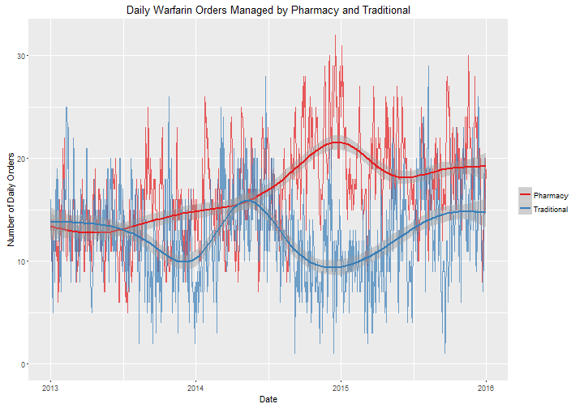
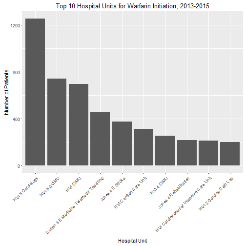
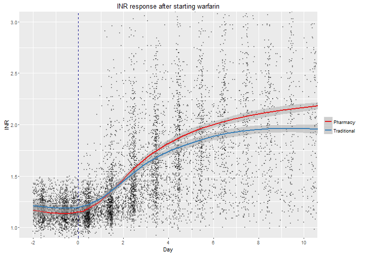
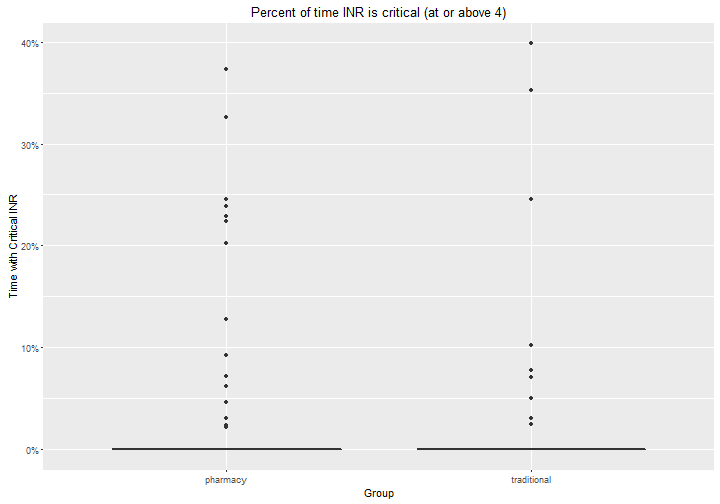

Warfarin Pharmacy Dosing Service Analysis
========================================================
author: Brian Gulbis
date: June 2016
autosize: true

Annual Warfarin Utilization
========================================================

Utilization of Pharmacy Warfarin Dosing Service
========================================================

Utilization of Pharmacy Warfarin Dosing Service
========================================================

Utilization by Medical Service
========================================================

Dosing Service Utilization by Medical Service
========================================================

Utilization by Hospital Unit
========================================================

Comparison
========================================================

* Group 1 - Pharmacy Dosing Service
    - Consult placed within 48 hours of warfarin initiation
    - &ge; 60% of warfarin doses placed by pharmacist
* Group 2 - Traditional Dosing

Methods: Inclusion
========================================================

* January 1, 2015 to December 31, 2015
* Age &ge; 18 years
* Received at least 3 doses of warfarin
* Baseline INR < 1.5

Methods: Exclusion
========================================================

* Concurrent DTI or TSOAC
* Liver dysfunction
    - AST and ALT > 5x ULN (concurrently)
    - ALT > 10x ULN
    - T.Bili > 3x ULN
* Missing goals of therapy data

Demographics
========================================================

|                     |pharmacy             |traditional          |p      |
|:--------------------|:--------------------|:--------------------|:------|
|n                    |402                  |287                  |       |
|Age (Median [Iqr])   |58.00 [42.25, 68.75] |64.00 [54.00, 72.00] |<0.001 |
|Sex = Male (%)       |240 (59.7)           |183 (64.0)           |0.290  |
|Race (%)             |                     |                     |0.093  |
|-   African American |104 (28.4)           |74 (27.7)            |       |
|-   Asian            |12 ( 3.3)            |1 ( 0.4)             |       |
|-   Native Am.       |0 ( 0.0)             |1 ( 0.4)             |       |
|-   Other            |78 (21.3)            |59 (22.1)            |       |
|-   White/Caucasian  |172 (47.0)           |132 (49.4)           |       |
|Length of Stay       |12.10 [7.71, 19.83]  |13.71 [8.02, 24.12]  |0.110  |

Anticoagulation Indications
========================================================

Disposition
========================================================

Changes in INR
========================================================

Time in Therapeutic Range
========================================================

Time with Critical INR Values
========================================================

Changes in Hemoglobin
========================================================

Historical Comparison
========================================================

* January 1, 2013 to December 31, 2014
* Same inclusion and exclusion criteria

Historical Demographics
========================================================

|                     |pharmacy             |traditional          |p      |
|:--------------------|:--------------------|:--------------------|:------|
|n                    |866                  |894                  |       |
|Age (Median [Iqr])   |59.00 [46.00, 71.00] |62.00 [51.00, 73.00] |<0.001 |
|Sex = Male (%)       |505 (58.3)           |526 (58.9)           |0.840  |
|Race (%)             |                     |                     |0.434  |
|-   African American |245 (31.2)           |228 (28.1)           |       |
|-   Asian            |15 ( 1.9)            |13 ( 1.6)            |       |
|-   Latin American   |1 ( 0.1)             |0 ( 0.0)             |       |
|-   Native Am.       |0 ( 0.0)             |1 ( 0.1)             |       |
|-   Other            |133 (16.9)           |131 (16.2)           |       |
|-   White/Caucasian  |392 (49.9)           |437 (54.0)           |       |
|Length of Stay       |11.85 [7.38, 18.62]  |10.94 [6.89, 17.28]  |0.024  |

Dosing Service Utilization by Medical Service (vs. Historical)
========================================================

Anticoagulation Indications (vs. Historical)
========================================================

Disposition (vs. Historical)
========================================================

Changes in INR (vs. Historical)
========================================================

Time in Therapeutic Range (vs. Historical)
========================================================

Time Critical INR (vs. Historical)
========================================================

Changes in Hemoglobin (vs. Historical)
========================================================

