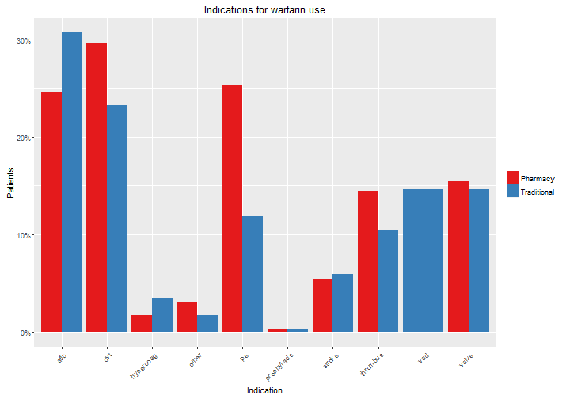
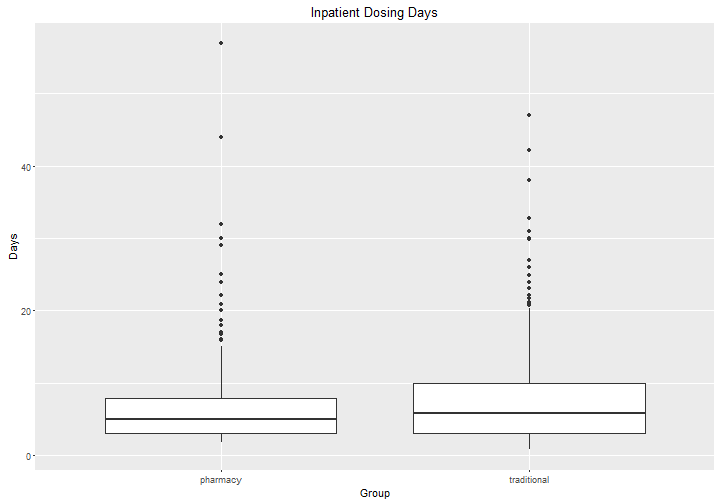
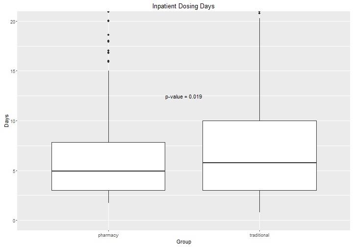
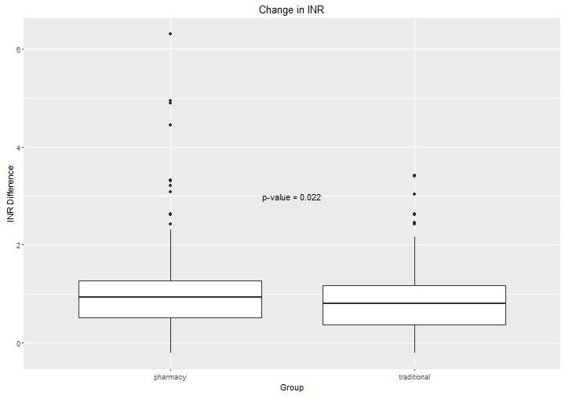
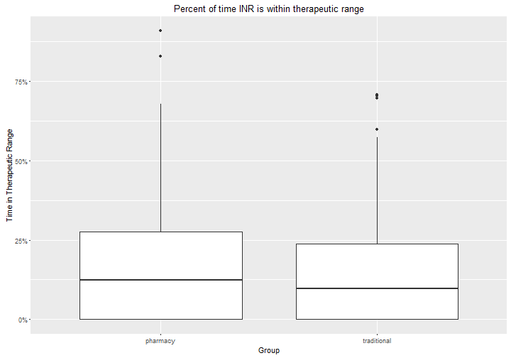
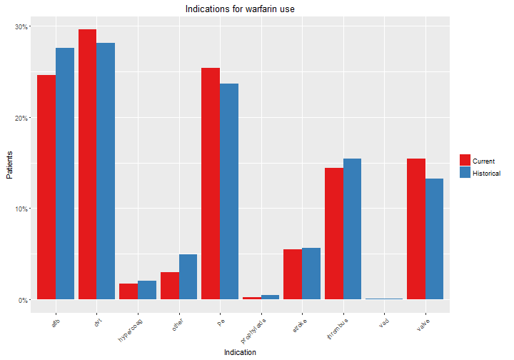
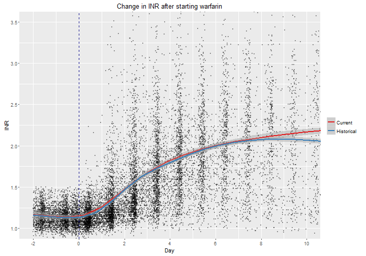
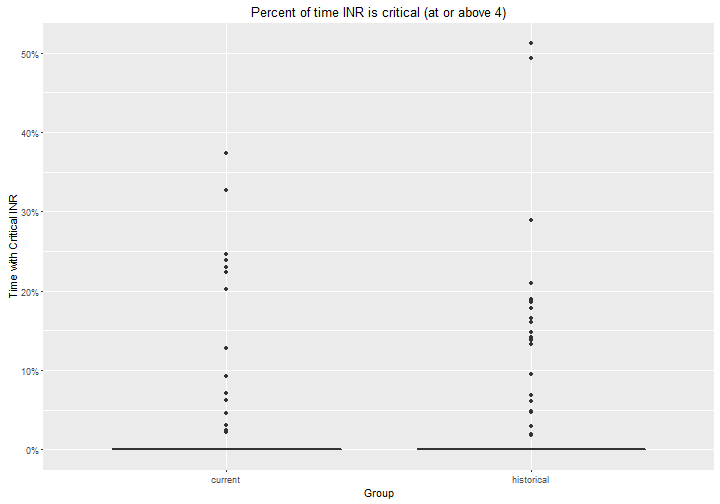
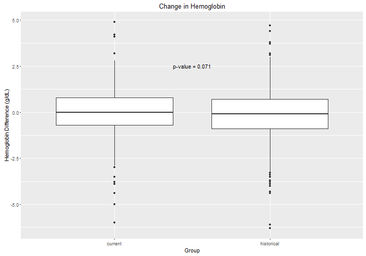

Warfarin Pharmacy Dosing Service Analysis
========================================================
author: Brian Gulbis
date: June 2016
autosize: true

Annual Warfarin Utilization
========================================================

Utilization of Pharmacy Dosing Service
========================================================

Orders by Pharmacy Dosing Service
========================================================

Utilization by Medical Services
========================================================

Comparison
========================================================

* Group 1 - Pharmacy Dosing Service
    - Consult placed within 48 hours of warfarin initiation
    - &ge; 60% of warfarin doses placed by pharmacist
* Group 2 - Traditional Dosing

Methods: Inclusion
========================================================

* January 1, 2015 to December 31, 2015
* Age &ge; 18 years
* Received at least 3 doses of warfarin
* Baseline INR < 1.5

Methods: Exclusion
========================================================

* Concurrent DTI or TSOAC
* Liver dysfunction
    - AST and ALT > 5x ULN (concurrently)
    - ALT > 10x ULN
    - T.Bili > 3x ULN
* Missing goals of therapy data
* Readmission encounters

Demographics
========================================================

|                              |pharmacy             |traditional          |p      |
|:-----------------------------|:--------------------|:--------------------|:------|
|n                             |402                  |285                  |       |
|Age (median [IQR])            |58.00 [42.25, 68.75] |64.00 [54.00, 72.00] |<0.001 |
|Sex = Male (%)                |240 (59.7)           |182 (64.1)           |0.279  |
|BMI (median [IQR])            |28.48 [24.40, 33.54] |29.32 [25.18, 33.68] |0.277  |
|Race (%)                      |                     |                     |0.096  |
|-   African American          |104 (28.4)           |74 (27.9)            |       |
|-   Asian                     |12 ( 3.3)            |1 ( 0.4)             |       |
|-   Native Am.                |0 ( 0.0)             |1 ( 0.4)             |       |
|-   Other                     |78 (21.3)            |59 (22.3)            |       |
|-   White/Caucasian           |172 (47.0)           |130 (49.1)           |       |
|Length of Stay (median [IQR]) |12.10 [7.71, 19.83]  |13.71 [8.04, 24.17]  |0.103  |
|Therapy = New/Previous (%)    |270/132 (67.2/32.8)  |143/142 (50.2/49.8)  |<0.001 |

Anticoagulation Indications
========================================================

Disposition
========================================================

Inpatient Dosing Days
========================================================

Inpatient Dosing Days - Closer Look
========================================================

INR Response
========================================================

Change in INR
========================================================

Time in Therapeutic Range
========================================================

Time with Critical INR Values
========================================================

Hemoglobin Response
========================================================

Change in Hemoglobin
========================================================

Historical Comparison
========================================================

* Pharmacy Dosing Service 2015 vs. 2013-2014
* Same inclusion and exclusion criteria

Historical Demographics
========================================================

|                               |current              |historical           |p     |
|:------------------------------|:--------------------|:--------------------|:-----|
|n                              |402                  |866                  |      |
|Age (median [IQR])             |58.00 [42.25, 68.75] |59.00 [46.00, 71.00] |0.048 |
|Sex = Male (%)                 |240 (59.7)           |505 (58.3)           |0.685 |
|BMI (mean (sd))                |29.95 (8.50)         |29.90 (9.26)         |0.926 |
|Race (%)                       |                     |                     |0.189 |
|-   African American           |104 (28.4)           |245 (31.2)           |      |
|-   Asian                      |12 ( 3.3)            |15 ( 1.9)            |      |
|-   Latin American             |0 ( 0.0)             |1 ( 0.1)             |      |
|-   Other                      |78 (21.3)            |133 (16.9)           |      |
|-   White/Caucasian            |172 (47.0)           |392 (49.9)           |      |
|-Length of Stay (median [IQR]) |12.10 [7.71, 19.83]  |11.85 [7.38, 18.62]  |0.172 |
|Therapy = New/Previous (%)     |270/132 (67.2/32.8)  |604/262 (69.7/30.3)  |0.390 |

Utilization by Medical Services
========================================================

Anticoagulation Indications
========================================================

Disposition
========================================================

INR Response
========================================================

Time in Therapeutic Range
========================================================

Time Critical INR
========================================================

Hemoglobin Response
========================================================

Change in Hemoglobin
========================================================

