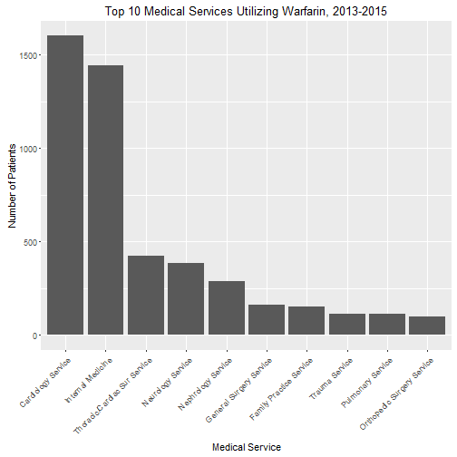

Warfarin Pharmacy Dosing Service Analysis
========================================================
author: Brian Gulbis
date: April 2016
autosize: true

Annual Warfarin Utilization
========================================================

Utilization by Medical Service
========================================================

Utilization by Hospital Unit
========================================================

Comparison
========================================================

* Group 1 - Pharmacy Dosing Service
    - Consult placed within 48 hours of warfarin initiation
    - &ge; 60% of warfarin doses placed by pharmacist
* Group 2 - Traditional Dosing

Methods: Inclusion
========================================================

* January 1, 2015 to December 31, 2015
* Age &ge; 18 years
* Received at least 3 doses of warfarin
* Baseline INR < 1.5

Methods: Exclusion
========================================================

* Concurrent DTI or TSOAC
* Liver dysfunction
    - AST and ALT > 5x ULN (concurrently)
    - ALT > 10x ULN
    - T.Bili > 3x ULN
* Missing goals of therapy data
